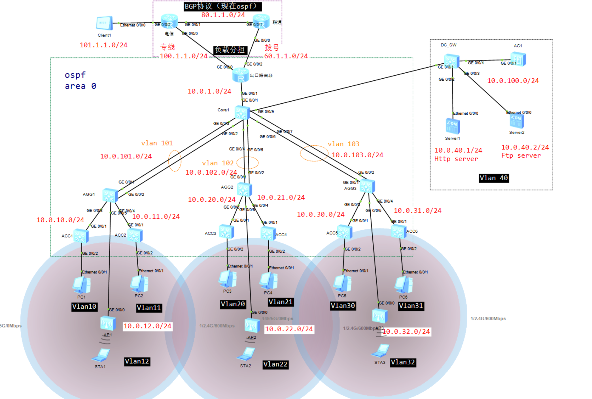
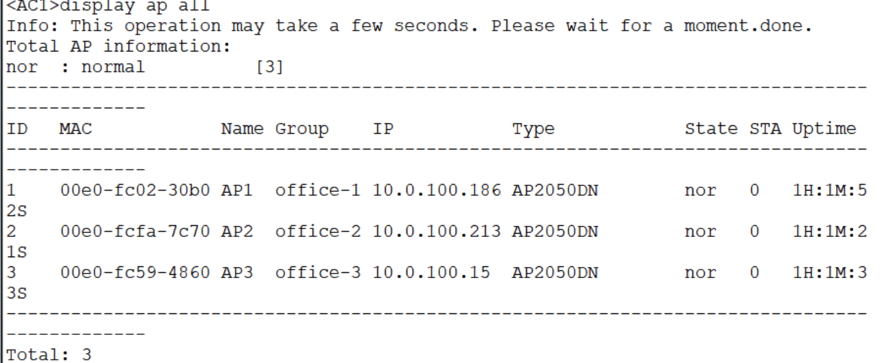
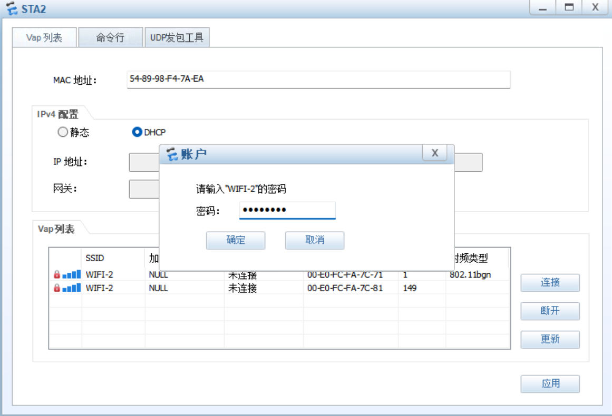
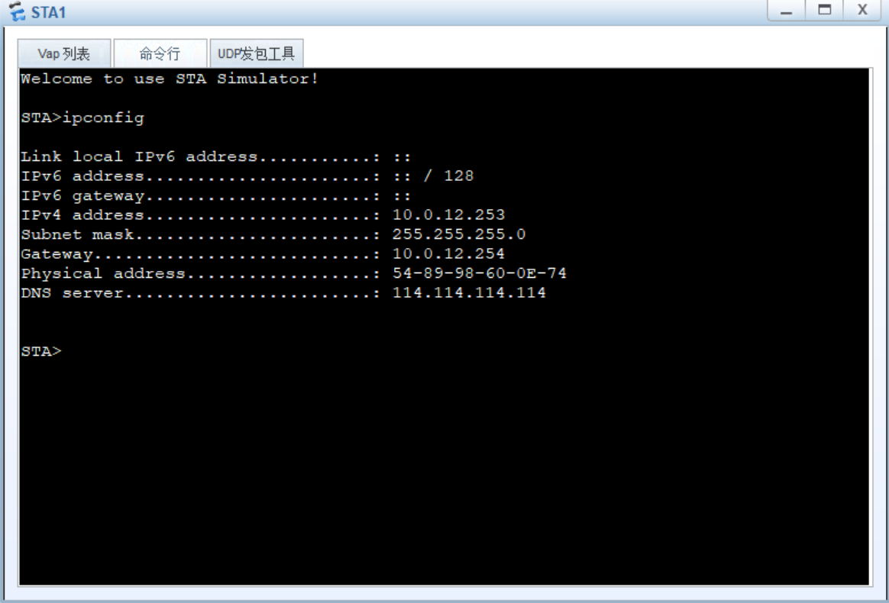
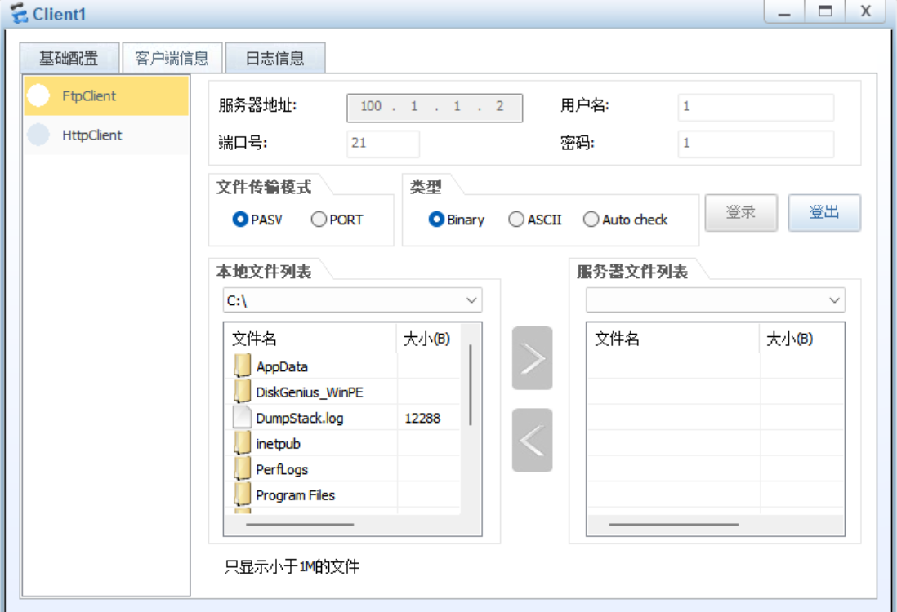
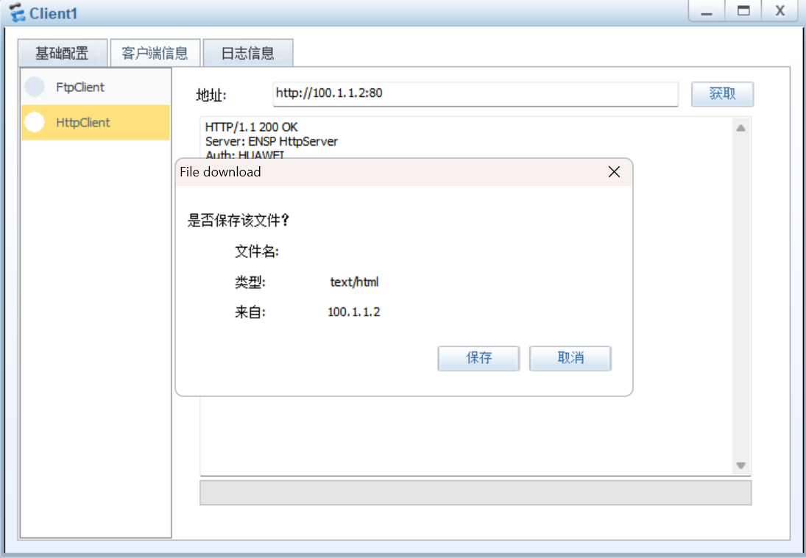

# 中小型企业园区网项目（hcia项目）

## 一、项目需求

1. 园区内部通过`OSPF`进行组网，并且所有设备在同一个区域.其中core1是核心交换机、AGG设备为楼层汇聚交换设备、ACC为入口层接入设备.其中楼层网关配置在AGG设备上面，并且需要为终端分配IP地址和DNS等参数；数据中心的网关配置在core1核心设备上.
2. 汇聚和核心之间的链路通过配置链路聚合增加接入带宽.
3. 有线用户、无线用户的上网VLAN如图所示，三层设备之间的互联VLAN自行规划.
4. AC通过纳管AP，需要实现三个不同楼层的无线终端业务VLAN分别为`VLAN12、13、14，并且拥有不同的SSID.`
5. 公司出口租用了一条`专线（电信线路）`，用于提供内部服务器的访问需求；并租用了一条`PPPoE拨号链路`，用于内部员工上网需求.（由于hcia还没有接触业务分流，所以在出口路由器的两个出口改为等价路由即负载分担）

---

## 二、网络设计

### Step 1 链路聚合

要实现交换机之间的路由，需要用`vlanif`接口配置ip地址形成互联.先把核心交换机与汇聚层交换机的链路聚合配置好，就可以满足条件2.

 四台交换机的链路聚合配置命令:

```
对于 CORE 交换机：
# 对接 AGG1 的聚合组
 interface Eth-Trunk 1
  mode lacp-static
  trunkport GigabitEthernet 0/0/2
  trunkport GigabitEthernet 0/0/3
# 对接 AGG2 的聚合组
 interface Eth-Trunk 2
  mode lacp-static
  trunkport GigabitEthernet 0/0/4
  trunkport GigabitEthernet 0/0/5
# 对接 AGG3 的聚合组
 interface Eth-Trunk 3
  mode lacp-static
  trunkport GigabitEthernet 0/0/6
  trunkport GigabitEthernet 0/0/7

 对于 AGG1 交换机：
# 对接 CORE 的聚合组
 interface Eth-Trunk 1
  mode lacp-static
# 上行物理端口加入聚合组
  trunkport GigabitEthernet 0/0/1
  trumkport GigabitEthernet 0/0/2


对于 AGG2 交换机：
# 对接 CORE 的聚合组
 interface Eth-Trunk 2
  mode lacp-static
# 上行物理端口加入聚合组
  trunkport GigabitEthernet 0/0/1
  trumkport GigabitEthernet 0/0/2

 对于 AGG3 交换机：
# 对接 CORE 的聚合组
 interface Eth-Trunk 3
  mode lacp-static
# 上行物理端口加入聚合组
  trunkport GigabitEthernet 0/0/1
  trumkport GigabitEthernet 0/0/2
```

---

### Step 2 交换机vlan IP地址 DHCP和dns配置

CORE交换机,AGG交换机,ACC交换机以及服务器交换机的vlan配置和ip地址的配置命令和开启DHCP的配置命令:

```
核心交换机配置:
# 批量创建所需VLAN，其中101，102，103是互联vlan，40是服务器vlan，100是管理vlan
 vlan batch 40 101 102 103 100
#上行路由器接口（因为此交换机的G0/0/1接口配置不能配置地址所以用本征vlan）
interface Vlanif1
 ip address 10.0.1.2 255.255.255.0
# 与AGG1互联三层接口
interface Vlanif 101
 ip address 10.0.101.254 255.255.255.0
# 与AGG2互联三层接口
interface Vlanif 102
 ip address 10.0.102.254 255.255.255.0
# 与AGG3互联三层接口
interface Vlanif 103
 ip address 10.0.103.254 255.255.255.0
# 数据中心服务器区网关
interface Vlanif 40
 ip address 10.0.40.254 255.255.255.0

 AGG1交换机配置（业务和办公开启DHCP功能并配置DNS):
 # 开启DHCP
 dhcp enable
 # 批量创建所需VLAN
 vlan batch 10 11 12 101 100
# 与CORE互联三层接口
interface Vlanif 101
 ip address 10.0.101.1 255.255.255.0
# Vlan10 有线办公网关
interface Vlanif 10
 ip address 10.0.10.254 255.255.255.0
 dhcp select interface
 dhcp server dns-list 114.114.114.114
# Vlan11 有线办公网关
interface Vlanif 11
 ip address 10.0.11.254 255.255.255.0
 dhcp select interface
 dhcp server dns-list 114.114.114.114
# Vlan12 无线业务网关
interface Vlanif 12
 ip address 10.0.12.254 255.255.255.0
 dhcp select interface
 dhcp server dns-list 114.114.114.114

 AGG2交换机配置:
 # 开启DHCP
 dhcp enable
 # 批量创建所需VLAN
 vlan batch 20 21 22 102 100
# 与CORE1互联三层接口
interface Vlanif 102
 ip address 10.0.102.1 255.255.255.0
# Vlan20 有线办公网关
interface Vlanif 20
 ip address 10.0.20.254 255.255.255.0
 dhcp select interface
 dhcp server dns-list 114.114.114.114
# Vlan21 有线办公网关
interface Vlanif 21
 ip address 10.0.21.254 255.255.255.0
 dhcp select interface
 dhcp server dns-list 114.114.114.114
# Vlan22 无线业务网关
interface Vlanif 22
 ip address 10.0.22.254 255.255.255.0
 dhcp select interface
 dhcp server dns-list 114.114.114.114

 AGG3交换机配置:
 # 开启DHCP
 dhcp enable
 # 批量创建所需VLAN
 vlan batch 30 31 32 103 100
# 与CORE1互联三层接口
interface Vlanif 103
 ip address 10.0.103.1 255.255.255.0
# Vlan30 有线办公网关
interface Vlanif 30
 ip address 10.0.30.254 255.255.255.0
 dhcp select interface
 dhcp server dns-list 114.114.114.114
# Vlan31 有线办公网关
interface Vlanif 31
 ip address 10.0.31.254 255.255.255.0
 dhcp select interface
 dhcp server dns-list 114.114.114.114
# Vlan32 无线业务网关
interface Vlanif 32
 ip address 10.0.32.254 255.255.255.0
 dhcp select interface
 dhcp server dns-list 114.114.114.114

 接入层交换机创建有线终端vlan:
 ACC1:
 vlan 10
 ACC2:
 vlan 11
 ACC3:
 vlan 20
 ACC4:
 vlan 21
 ACC5:
 vlan 30
 ACC6:
 vlan 31

 服务器交换机vlan:
 # DC_SW:
  vlan batch 100 40
```

---

### Step 3 交换机链路类型

每个交换机链路类型配置:

 CORE交换机:

```
#上行出口路由器
interface GigabitEthernet0/0/1
 port link-type access

# 下行聚合链路1（对接AGG1）
interface Eth-Trunk 1
 port link-type trunk
 port trunk allow-pass vlan 100 101

# 下行聚合链路2（对接AGG2）
interface Eth-Trunk 2
 port link-type trunk
 port trunk allow-pass vlan 100 102

# 下行聚合链路3（对接 AGG3）
interface Eth-Trunk 3
 port link-type trunk
 port trunk allow-pass vlan 100 103

# 下联数据中心DC_SW
interface GigabitEthernet 0/0/9
 port link-type trunk
 port trunk allow-pass vlan 40 100
```

AGG1（<mark>需注意配置pvid</mark>）:

```
# 下行连 ACC1
interface GigabitEthernet 0/0/3
 port link-type trunk
 port trunk allow-pass vlan 10

# 下行连 ACC2
interface GigabitEthernet 0/0/4
 port link-type trunk
 port trunk allow-pass vlan 11

# 下行连AP1（ Vlan12 无线业务）
interface GigabitEthernet 0/0/5
 port link-type trunk
 port trunk allow-pass vlan 12 100
 port trunk pvid vlan 100

# 上行聚合链路（已创建 Eth-Trunk1，补充放通 VLAN）
interface Eth-Trunk 1
 port link-type trunk
 port trunk allow-pass vlan 100 101
```

AGG2（<mark>需注意配置pvid</mark>）:

```
# 上行链路聚合
interface Eth-Trunk2
 port link-type trunk
 port trunk allow-pass vlan 100 102

# 下行连ACC3
interface GigabitEthernet0/0/3
 port link-type trunk
 port trunk allow-pass vlan 20

# 下行连ACC4
interface GigabitEthernet0/0/4
 port link-type trunk
 port trunk allow-pass vlan 21

# 下行连AP2
interface GigabitEthernet0/0/5
 port link-type trunk
 port trunk pvid vlan 100
 port trunk allow-pass vlan 22 100
```

AGG3（<mark>需注意配置pvid</mark>）:

```
# 上行链路聚合
interface Eth-Trunk3
 port link-type trunk
 port trunk allow-pass vlan 100 103
 mode lacp-static

# 下行连ACC4
interface GigabitEthernet0/0/3
 port link-type trunk
 port trunk allow-pass vlan 30

# 下行连ACC5
interface GigabitEthernet0/0/4
 port link-type trunk
 port trunk allow-pass vlan 31

# 下行连AP3
interface GigabitEthernet0/0/5
 port link-type trunk
 port trunk pvid vlan 100
 port trunk allow-pass vlan 32 100
```

ACC1-ACC6：

```
1：
#上行连AGG1为trunk口
interface GigabitEthernet0/0/1
 port link-type trunk
 port trunk allow-pass vlan 10
#下行为终端PC
interface GigabitEthernet0/0/2
 port link-type access
 port default vlan 10

2：
#
interface GigabitEthernet0/0/1
 port link-type trunk
 port trunk allow-pass vlan 11
#
interface GigabitEthernet0/0/2
 port link-type access
 port default vlan 11

3：
#
interface GigabitEthernet0/0/1
 port link-type trunk
 port trunk allow-pass vlan 20
#
interface GigabitEthernet0/0/2
 port link-type access
 port default vlan 20

4：
#
interface GigabitEthernet0/0/1
 port link-type trunk
 port trunk allow-pass vlan 21
#
interface GigabitEthernet0/0/2
 port link-type access
 port default vlan 21

5：
#
interface GigabitEthernet0/0/1
 port link-type trunk
 port trunk allow-pass vlan 30
#
interface GigabitEthernet0/0/2
 port link-type access
 port default vlan 30

6：
#
interface GigabitEthernet0/0/1
 port link-type trunk
 port trunk allow-pass vlan 31
#
interface GigabitEthernet0/0/2
 port link-type access
 port default vlan 31
```

DC_SW:

```
#上行连核心交换机
interface GigabitEthernet0/0/1
 port link-type trunk
 port trunk allow-pass vlan 40 100
#下行连Http服务器
interface GigabitEthernet0/0/2
 port link-type access
 port default vlan 40
#下行连Ftp服务器
interface GigabitEthernet0/0/3
 port link-type access
 port default vlan 40
#下行连AC
interface GigabitEthernet0/0/4
 port link-type trunk
 port trunk allow-pass vlan 100
```

---

### Step 4 AC配置vlan IP地址 DHCP 和 dns

AC也需要开启DHCP功能和配置dns并配置链路类型和创建vlan配置IP地址：

```
#上行连DC_SW
interface GigabitEthernet0/0/1
 port link-type trunk
 port trunk allow-pass vlan 100

# 开启DHCP
 dhcp enable
# 创建vlan100
 vlan 100
#
interface Vlanif100
 ip address 10.0.100.254 255.255.255.0
 dhcp select interface
 dhcp server dns-list 114.114.114.114 
```

这样就可以在 AP 当中看到 AC 分配的 IP 地址了.

---

### Step 5 实现无线功能

在此之前先配置capwap隧道（必须指定一个三层接口，如 Vlanif100）

```
 capwap source interface vlanif100
# 注意：前提是你已经在系统视图下创建了 Vlanif100 并配置了 IP，
且 Vlanif100 处于 UP 状态。
```

##### 1.ap上线

```
# 先进入 wlan 视图
 wlan
# 创建三个 ap 组并命名的模板
 ap-group name office1
 ap-group name office2
 ap-group name office3
 # 进行 ap 认证，先进入到 wlan 模式（ mac 地址认证）
 ap-id 1 ap-mac 00e0-fc02-30b0  #AC1的vlanif1的mac地址
 # 命名
  ap-name ap1
 # 加入到 office-1 组中
  ap-group office-1

 # 以下命令同理
 ap-id 2 ap-mac 00e0-fcfa-7c70
  ap-name ap2
  ap-group office-2

 ap-id 3 ap-mac 00e0-fc59-4860
  ap-name ap3
  ap-group office-3
```



##### 2.ssid配置

```
# 在 wlan 视图里面创建 ssid 模板 1，2，3.并且分别命名网络名称
ssid-profile name SSID-1
 ssid WIFI-1
ssid-profile name SSID-2
 ssid WIFI-2
ssid-profile name SSID-3
 ssid WIFI-3
```

可以得到三个 ssid 的模板，每个模板都有一个 WIFI

##### 3.password配置

```
# 在 wlan 视图创建密码模板并命名为 Mypassword
 security-profile name Mypassword
# 密码设为 tltt1234
  security wpa-wpa2 psk pass-phrase tltt1234 aes
```

三个网络使用同一个模板

##### 4.vap配置

```
# 在 wlan 视图里创建 vap 模板命名为 VAP-1
vap-profile name VAP-1
# 业务 vlan 配置
 service-vlan vlan-id 12
# 配置第一个 ssid 模板
 ssid-profile SSID-1
# 配置第一个密码模板
 security-profile Mypassword

 以下同理
vap-profile name VAP-2
 service-vlan vlan-id 22
 ssid-profile SSID-2
 security-profile Mypassword

vap-profile name VAP-3
 service-vlan vlan-id 32
 ssid-profile SSID-3
 security-profile Mypassword
```

##### 5.调用VAP模板

```
# 在 wlan 视图，进入 ap 组 office-1
ap-group name office-1
# 调用vap模板
 vap-profile VAP-1 wlan 1 radio all

以下同理
ap-group name office-2
 vap-profile VAP-2 wlan 2 radio all

ap-group name office-3
 vap-profile VAP-3 wlan 3 radio all
```





这样我们可以使用无线终端连接 AP 实现无线功能了.

---

### Step 6 路由器配置并实现路由功能（OSPF协议路由）

```
# 出口路由器的 IP 地址配置 （当前只配私网）
# 下连核心交换机的接口配置 IP 地址
interface GigabitEthernet0/0/1
 ip address 10.0.1.1 255.255.255.0 

# 用 OSPF 协议使私网区域的网络互通
# 出口路由器:
ospf 1 
 area 0.0.0.0 
  network 10.0.1.0 0.0.0.255

# 核心交换机:
ospf 1
 area 0.0.0.0
  network 10.0.1.0 0.0.0.255
  network 10.0.101.0 0.0.0.255
  network 10.0.102.0 0.0.0.255
  network 10.0.103.0 0.0.0.255
  network 10.0.40.0 0.0.0.255

# AGG1:
ospf 1
 area 0.0.0.0
  network 10.0.101.0 0.0.0.255
  network 10.0.10.0 0.0.0.255
  network 10.0.12.0 0.0.0.255
  network 10.0.11.0 0.0.0.255

# AGG2:
ospf 1
 area 0.0.0.0
  network 10.0.102.0 0.0.0.255
  network 10.0.20.0 0.0.0.255
  network 10.0.21.0 0.0.0.255
  network 10.0.22.0 0.0.0.255

# AGG3:
ospf 1
 area 0.0.0.0
  network 10.0.103.0 0.0.0.255
  network 10.0.30.0 0.0.0.255
  network 10.0.31.0 0.0.0.255
  network 10.0.32.0 0.0.0.255
```

 用display ospf peer 就可以知道每个设备的邻居，从而检验是否配置成功.

 在终端设备 ping 服务器可以 ping 通就证明了私网已经互通了.

---

### Step 7 实现私网设备可以访问公网

##### 1. PPPoe 拨号链路配置

联通作为拨号服务器：通过数据库认证用PPP协议分配IP地址给出口路由器

```
# 先进入联通路由器的 aaa 视图，创建账号和对应的密码
aaa
 local-user ttt password cipher huawei
 # 把认证模式设置为ppp
 local-user ttt service-type ppp

# 创建一个名为 ppp.pool 的地址池
ip pool ppp.pool
 # 往地址池内加入一个网段
 network 60.1.1.0 mask 24

# 拨号必须在 V-T 接口配置
interface Virtual-Template1
 # ppp的认证模式为 chap
 ppp authentication-mode chap 
 # 从 ppp.pool 地址池中分配 IP 地址
 remote address pool ppp.pool
 # V-T 接口的 IP 地址配置
 ip address 60.1.1.1 24 

# 绑定物理接口
interface GigabitEthernet0/0/0
 # 服务端用 pppoe-server 绑定 V-T 接口
 pppoe-server bind Virtual-Template 1
```

出口路由器作为被认证方需要登陆认证才能获取到IP地址.

```
# 拨号上网必须在 Dialer 接口配置
interface Dialer1
 # 默认的二层封装协议就是 ppp
 link-protocol ppp
 # 登录
 ppp chap user ttt
 ppp chap password cipher huawei
 # 用 ppp 协商协议获取 IP 地址
 ip address ppp-negotiate
 # 写上 dialer 口的用户名字和绑定编号
 dialer user no1
 dialer bundle 1

# 绑定物理接口，添加接口描述为联通
interface GigabitEthernet0/0/2
 description liant
 # 被认证端使用绑定编号进行绑定
 pppoe-client dial-bundle-number 1 
```

在出口路由器就可以看到dialer1口获取到了IP地址

##### 2. 配置路由器的IP地址

```
# 出口路由器：
interface GigabitEthernet0/0/0
 # 添加描述
 description dianx
 ip address 100.1.1.2 24

# 电信路由器：
interface GigabitEthernet0/0/0
 ip address 100.1.1.1 255.255.255.0 
#
interface GigabitEthernet0/0/1
 ip address 80.1.1.1 255.255.255.0 
#
interface GigabitEthernet0/0/2
 ip address 101.1.1.254 255.255.255.0 

# 联通路由器：
interface GigabitEthernet0/0/1
 ip address 80.1.1.2 255.255.255.0 
```

##### 3. 实现路由器之间的路由功能

由于hcia阶段没有学习BGP协议，所以路由器之间用ospf协议实现路由功能.

```
# 电信：
ospf 1 
 area 0.0.0.0 
  network 80.1.1.0 0.0.0.255 
  network 100.1.1.0 0.0.0.255 
  network 101.1.1.0 0.0.0.255 

# 联通：
ospf 1 
 area 0.0.0.0 
  network 60.1.1.0 0.0.0.255 
  network 80.1.1.0 0.0.0.255 

# 出口路由器用缺省路由：
ip route-static 0.0.0.0 0.0.0.0 100.1.1.1
ip route-static 0.0.0.0 0.0.0.0 Dialer1
# 可以得到两个等价路由，实现负载分担
# 重要的是需要下发该缺省路由
ospf 1 
 default-route-advertise always
 # 这样就可以通过 ospf 的算法让交换机有了缺省路由
```

##### 4. ACL配置和NAT配置

```
# 出口路由器：
acl number 2000  
 # 允许所有的 IP 网段通过
 rule permit source any

# 接口出口配置 nat
interface Dialer1
 nat outbound 2000
#
interface GigabitEthernet0/0/0
 nat outbound 2000
```

---

### Step 8 实现外网设备访问内网服务器的服务

```
# 在出口路由器配置 nat server
interface GigabitEthernet0/0/0 
 nat server protocol tcp global current-interface ftp inside 10.0.40.2 ftp
 nat server protocol tcp global current-interface www inside 10.0.40.1 www
```

这样就可以用客户端连接两个服务器的服务了





---

## 三、项目总结

**本项目完成中小企业三层园区网络搭建，实现链路聚合提升链路带宽与可靠性、VLAN 技术实现业务逻辑隔离、DHCP 完成终端 IP 地址自动分配；同时部署专线与 PPPoE 拨号双上行互联网接入、AC+Fit‑AP 无线局域网业务，并配置 NAT‑Server 端口映射，支持外网访问内网服务器，满足企业日常办公的基础网络业务需求。**


